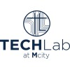

## TE Connectivity
- *Software Engineer Intern* | May'23 - Present
- 
- Tags: Internship
- Badges:
  - Badge [blue]
- List Items:
  -  Implement a IaaS-based Node.js backend for the FileSaver       application to retrieve and save real-time crimp JSON data over the OPC-UA protocol from the Crimp Monitor Machines (CQM)
  -  Database: Develop a databaseManager class with SQLite database, accommodating a 50% growth in data volume
  -  Back End: Implement an automated script for database CRUD operations and accurate filtered result verification
  - Front End: Display 10+ data visualizations for GUI, using Angular, D3.js library to visualize real-time data
  - Testing: Evaluate over 300 testcases and performed regression, unit, system testing using Mocha test framework
  - App Development Life Cycle: Utilize Agile techniques such as backlog, sprints, and Scrum to track tasks
  - Accelerate release cycles by 20% by implementing automated script into CICD pipeline
   

## Michigan Electric Veicle Center
- *Web Developer* | May'22 - Dec'23
- 
- Tags: Internship
- Badges:
  - Badge [blue]
- List Items:
  - Developed a website and built 7 pages using PHP, Javascript, HTML/CSS, NoSQL, visited by 300+ users/week
  - Extended the existing REST API by adding custom routes and endpoints to enable interaction with custom data types and facilitate the fetching and manipulation of posts, pages, users, and comments based on specific criteria

## JD.com
- *Tech Project Manager Intern* | May'21 - Aug'21
- 
- Tags: Internship
- Badges:
  - Badge [blue]
- List Items:
  - Utilized project management tools to track progress, identify potential delays, and implement contingency plans, contributing to a 15% improvement in overall project efficiency.
  - Conducted regular requirement gathering and feedback sessions with the client, ensuring alignment with their vision. 

## TechLab at Mcity  
- *Cohort Member* | Sept'22 - Dec'22
- 
- Tags: Research
- Badges:
  - Badge [blue]
- List Items:
  - Completed an open-ended autonomous vehicle project, assigned by Deepen 
  - Rendered the scenario in CARLA to depict the movement of actors such as cars and bikes, based on the LiDAR data annotated with these actors stored in the JSON file, with the goal of the final simulation can be used by Deepen to visually present results to its customers

## University of Michigan Transportation Research Institute
- *Student Researcher* | May'22 - Aug'22
- 
- Tags: Research
- Badges:
  - Badge [blue]
- List Items:
  - Collaborated with the student research team to implement a software extension to the CARLA open-source driving simulator to accelerate the development of targeted driving experiments by 30%
  - Interfaced with the CARLA server API to allow the GUI application to directly control the simulation world